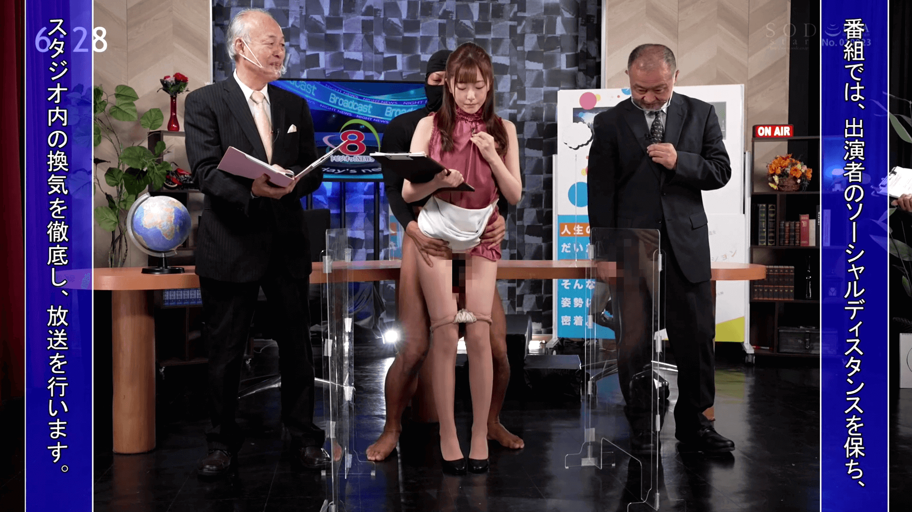
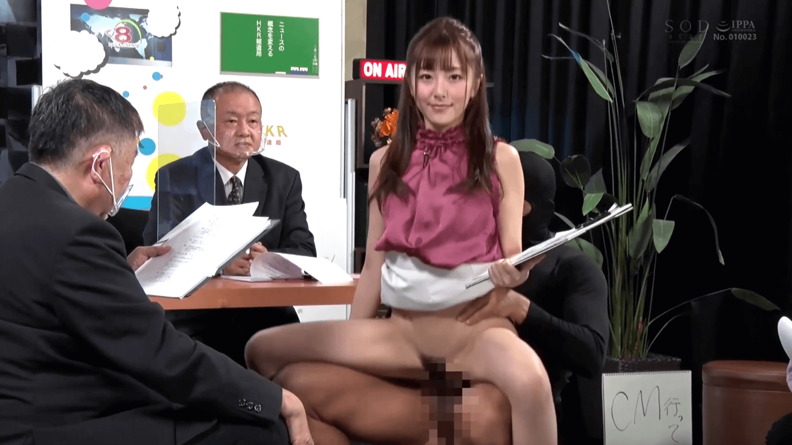
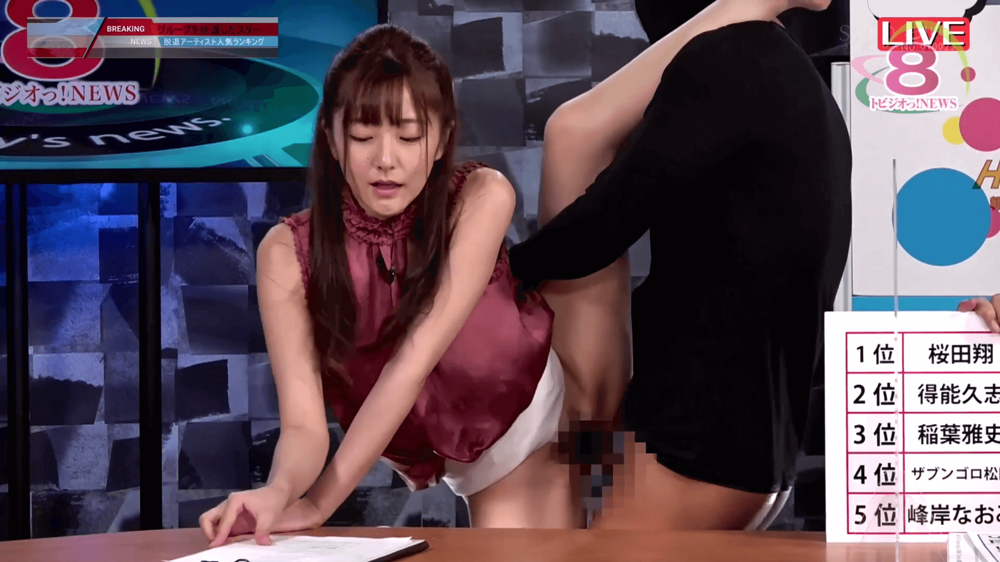
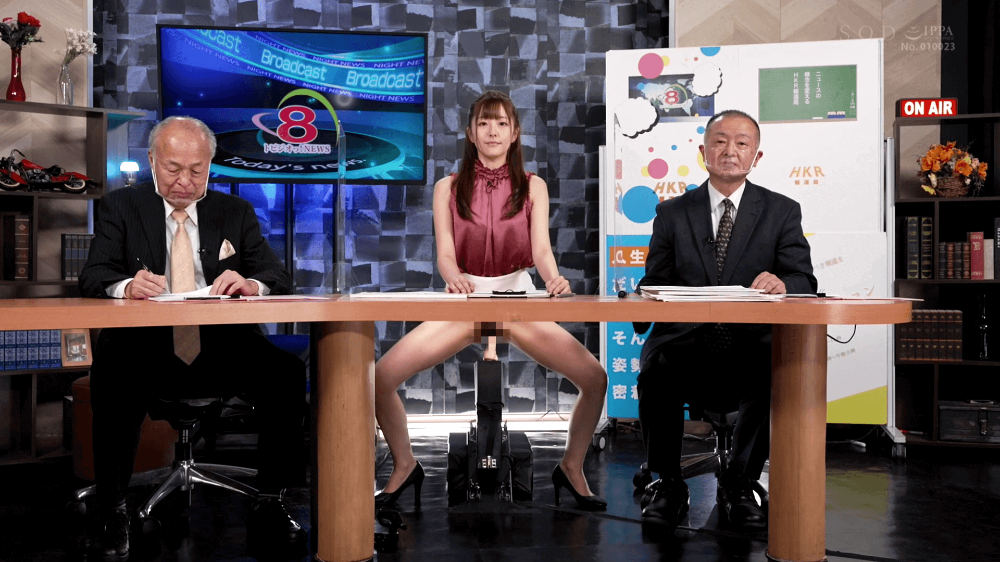

# STARS-368
```
[妇科检查 B-14.03.368.01.01.02] 18:22 - 47:58 
[齿科检查 B-14.03.368.01.01.03] 48:00 - 57:30 (无动作)
[身体检查 B-14.03.368.01.01.04] 57:32 - 1:04:37 (无动作)
[听诊 B-14.03.368.01.01.01] 2:40 - 18:20 (无动作)
[尿检 B-14.03.368.01.01.05] 1:04:40 - 1:39:14
[血检 B-14.03.368.01.01.06] 1:39:14 - end
```
||
|---|---|---|
||
||


# STARS-541
```
B-14.03.541.01.01.01
```
||
|---|---|---|
||
